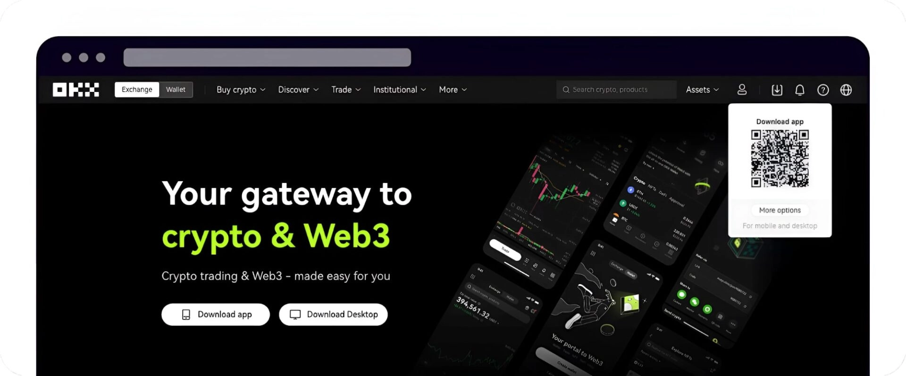
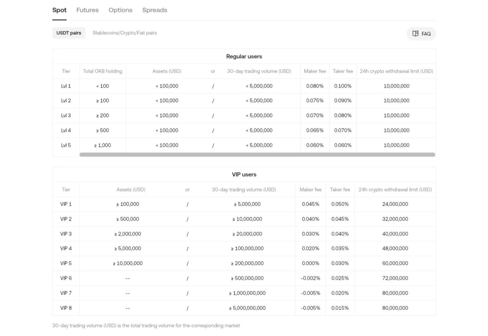
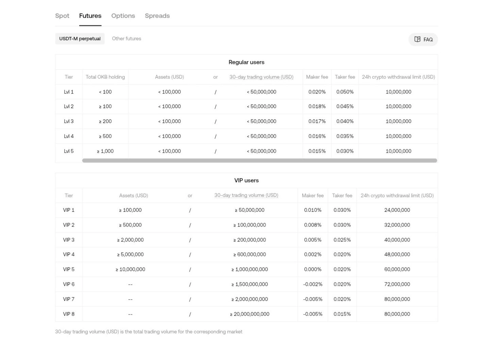
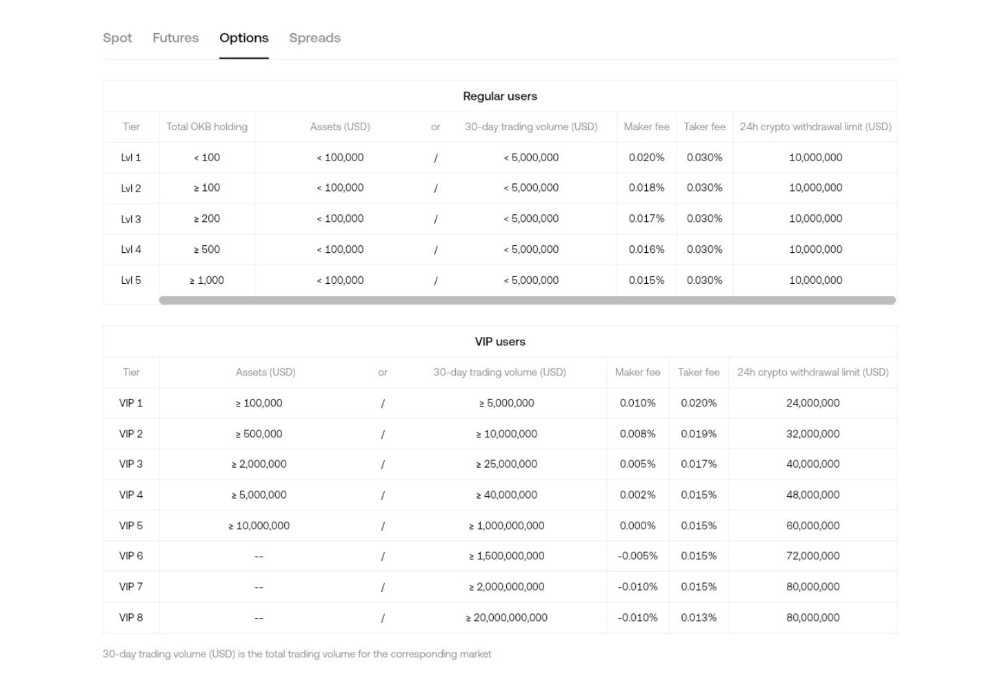
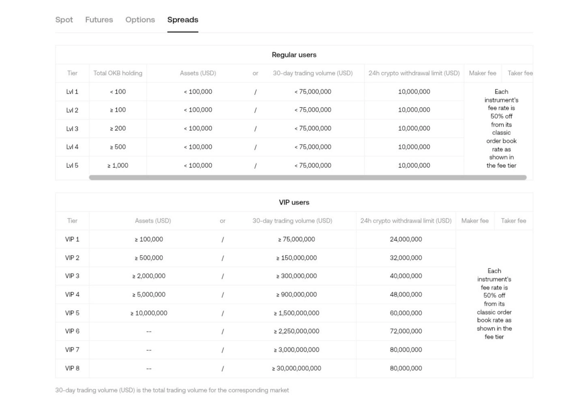
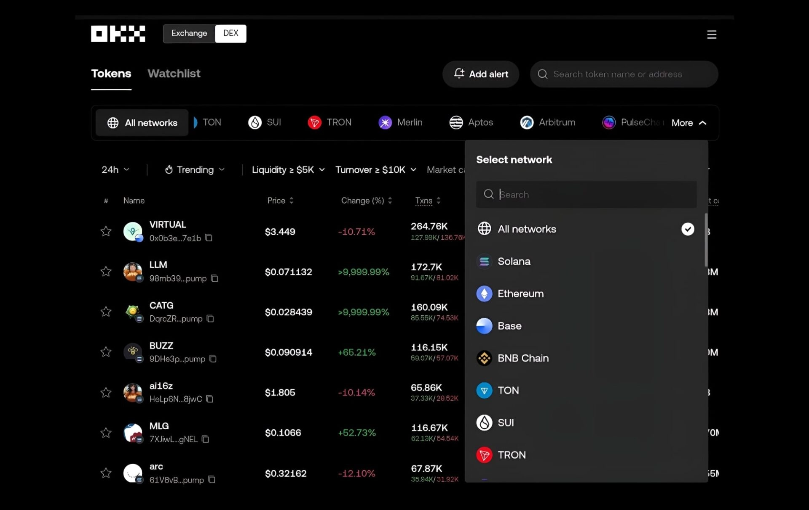
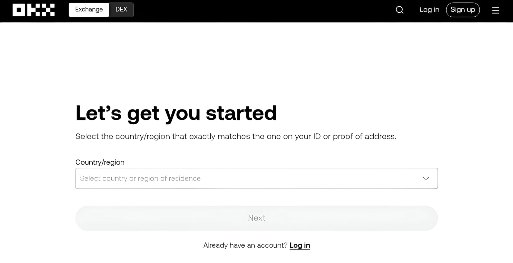
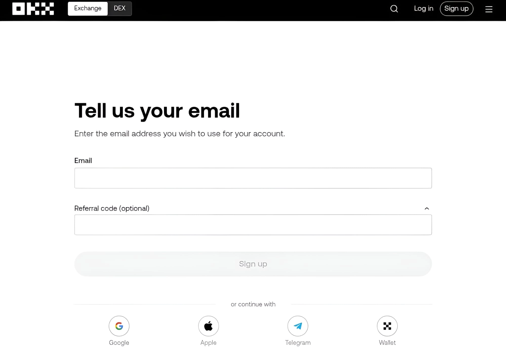
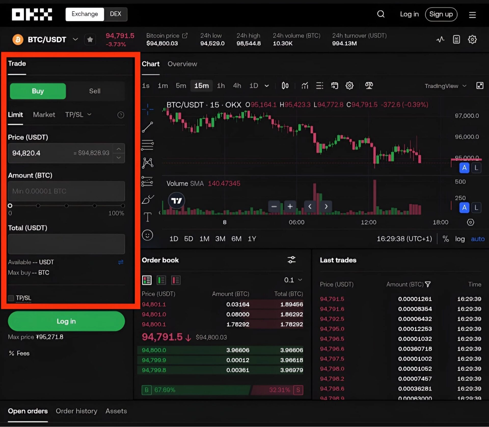
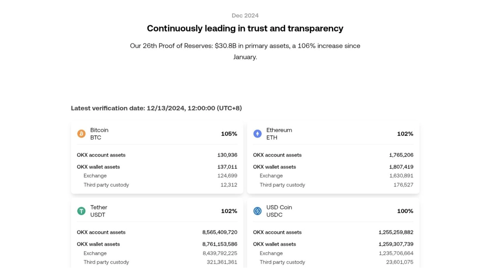

# OKX Review: Is It Safe & Legit to Buy Bitcoin and Crypto?

Looking for a crypto exchange that doesn't make you feel like you need a PhD to trade? OKX might be your answer. This platform handles everything from simple Bitcoin purchases to complex futures trading, all while keeping things surprisingly straightforward. Whether you're dipping your toes into crypto for the first time or you're already juggling multiple trading strategies, OKX offers the tools, security measures, and earning opportunities that matter in 2025.

---

So what exactly is OKX? Think of it as your one-stop shop for cryptocurrency activities. Founded in 2017 (originally as OKex), this exchange quickly evolved from a simple trading platform into something much more comprehensive. You can buy and sell crypto, sure, but you can also set up automated trading bots, earn passive income, and even explore the Web3 ecosystem—all from one platform.

The exchange runs on its own blockchain called the X-layer network and has a native token, **OKB**. This token isn't just sitting there looking pretty. You use it to pay trading fees at a discount, earn rewards through various programs, and participate in governance decisions on the platform. It's like having a VIP card that actually does something useful.

## Where Does OKX Operate?

OKX headquarters sits in Seychelles, but the company has spread its presence across the globe. They've set up offices in Hong Kong, Singapore, the UAE, Silicon Valley, and the Bahamas. This global footprint means they can provide support across different time zones and regulatory environments.

The platform supports trading in over 100 countries, including South Africa, Singapore, Kenya, Australia, the Netherlands, Argentina, and Seychelles. That's a lot of reach for a relatively young exchange.

**But here's where it gets tricky.** OKX isn't available everywhere. If you're in the United States, you're out of luck for the exchange services (though Web3 services are accessible). The same goes for several other locations:

**Completely off-limits:** United States and its territories, Belgium, France, Iran, Cuba, Bangladesh, North Korea, Bolivia, Malta, Crimea, Syria, Donetsk and Luhansk regions, and Ireland.

**Partially restricted:** Some countries can access certain features but not others:
- Belgium, Japan, Malaysia, and Cuba can't use margin and derivatives trading
- Canada isn't accepting new registrations (existing users can still access the platform)
- Hong Kong residents can't access derivatives services
- The UK, Bahamas, and Netherlands have no access to derivatives trading

The restriction list might change as regulations evolve, so it's worth checking the latest status if you're in a borderline region.

## What About Trading Fees?

OKX uses the maker-taker fee model, which is standard in the industry but worth understanding. Regular users pay 0.10% as takers and 0.08% as makers. These aren't the lowest fees out there, but they're competitive.

Here's the breakdown: makers create limit orders that don't fill immediately, adding liquidity to the platform. Takers grab existing orders, removing liquidity. Because makers help the platform, they pay lower fees.

For example, if Ethereum's lowest asking price is 2,700 USDT and you place a bid at 2,570 USDT, your order becomes a maker order. It sits in the order book until someone takes it. When someone does, you pay the maker fee.

The platform uses tiered pricing based on your 30-day trading volume and OKB holdings. Trade more or hold more OKB, and your fees drop. VIP users can get fees as low as 0% in some cases.

**Futures contracts** start at 0.05% for takers and 0.02% for makers. VIP 1 users pay 0.03% (taker) and 0.01% (maker).

**Options trading** begins at 0.02% for makers and 0.03% for takers. The calculation gets more complex here, factoring in forced liquidation fees and exercise fees (though 1-day options that don't expire on Friday skip the exercise fee).

**Spreads trading** gets a 50% discount on standard rates. So a VIP 1 user opening a BTC/USDT-margined perpetual spread pays 0.04% (maker) and 0.05% (taker).

## The Features That Actually Matter

Let's talk about what makes OKX interesting beyond basic buy-and-sell functionality.

### Trading Bots That Don't Require Coding

OKX offers 11 different trading bots. You don't need programming skills or hours of monitoring. These bots handle spot and futures grids, DCA strategies, smart arbitrage, signal trading, and more.

The **spot grid bot** splits your capital between two assets in a trading pair (like BTC/USDT). It creates price points between upper and lower limits, dividing your money equally across these grid levels. When prices drop, it buys more. When prices rise, it sells. You profit from the spread between buy and sell prices.

**Futures grid bots** work similarly but with more options:
- Long futures grids buy at current prices and sell when prices rise (good for bullish but volatile markets)
- Short futures grids sell at current prices and buy back when prices drop (perfect for bearish but choppy markets)
- Neutral futures grids trade both directions, profiting from any movement

**Smart arbitrage** uses a Delta-neutral strategy, holding equal but opposite positions in spot and perpetual swap markets. You buy crypto in the spot market while simultaneously selling it in the perpetual swap market. Price changes have minimal impact, and you earn from funding fees.

You can set up these bots manually, use AI recommendations, follow parameters suggested by the bot, or simply copy successful strategies from experienced traders.

👉 [Want to automate your trading and earn while you sleep? Start with OKX's proven bot strategies](https://www.okx.com/join/47044926)

### Copy Trading for Learning (or Earning)

Copy trading lets you mirror strategies from seasoned traders. When they open a position, you open the same position automatically. When they close, you close.

Transaction fees stay the same as your regular tier level. However, you share 8-13% of your profits with the lead trader. You can set maximum amounts per order and total investment limits. For instance, cap individual orders at 50 USDT with a total limit of 500 USDT for that trader. After ten positions, you hit your limit, and the eleventh position won't copy.

### The OKX Wallet: Your Web3 Gateway

The OKX Web3 wallet deserves special attention. Unlike the centralized exchange, this wallet is fully decentralized and non-custodial. You control your assets and private keys completely.

It supports over 60 blockchain networks and includes a built-in DEX aggregator for multi-chain and cross-chain transactions. Switch between networks without creating multiple wallets. Engage in yield farming, browse NFT marketplaces, or explore over 1,000 DApp protocols.

Benefits include:
- Full ownership and control of your assets
- Quick withdrawals without approval processes
- Automatic network recognition and connection
- Support for Ethereum, Aptos, Optimism, BSC, and more
- Available on iOS, Android, and web browsers

**Important:** OKX doesn't store your seed phrase, private key, or password. You're responsible for keeping these safe.

### Mobile App That Doesn't Compromise

The OKX mobile app packs everything from the desktop version into a cleaner, more intuitive interface. It's available on both Apple Store and Google Play.

The app offers simple mode for beginners and advanced mode for experienced traders. You can buy, sell, and convert crypto with fiat or other cryptocurrencies. Set limit and market orders with take-profit, stop-loss, and trailing stops. Trade on margin with up to 10X leverage, or hit futures and perpetual swaps with leverage up to 125X. Set alerts for specific price movements or position changes.

## Getting Started: Account Setup and First Trade

Opening an account takes about five minutes:

1. Select your country or region, agree to terms and privacy policy, click "Next"

2. Register with your email and add referral code **47044926** for bonuses

3. Enter the verification code sent to your email
4. Verify your phone number with another code via text
5. Create a strong password (at least 12 characters recommended)
6. Complete KYC verification by submitting identity documents (verified within 24 hours)

**To start trading:**

**Deposit funds** through the Assets tab. Choose cryptocurrency deposits from another wallet or use fiat options like credit cards (Visa, Mastercard), bank transfers, or P2P transactions. For crypto deposits, select your cryptocurrency and network, then transfer to the generated wallet address.

**Choose your trading method** in the Trade section. Pick between spot trading or derivatives (futures, margin, perpetual swaps). Beginners should start with spot markets or use copy trading to learn from experienced traders.

**Place your first trade** by selecting a trading pair like PEPE/USDT or BTC/USDT. Start small to get comfortable with the interface.

Use the order window to place buy or sell orders. Choose between market orders (execute immediately at current price), limit orders (execute when price reaches your specified level), or stop orders (trigger when certain conditions are met). Confirm your order and watch it execute according to your chosen parameters.

### Yes, KYC Is Required

OKX requires KYC verification like most legitimate exchanges. Submit personal identification documents—a selfie, passport, or driver's license. Make sure the information matches the region you selected during registration. The verification process typically completes within 24 hours.

## Is OKX Actually Safe?

Security matters more than flashy features. OKX takes this seriously with multiple protection layers.

**Cold wallet storage** keeps 95% of assets offline, away from potential hacks. The platform limits individual cold wallet addresses to 1,000 BTC maximum, spreading assets across multiple wallets. This prevents a single point of failure. Once funds in one cold wallet are withdrawn, that address no longer receives new deposits.

**Risk Shield** sets aside over $700 million from platform assets to protect users from potential breaches—similar to Binance's SAFU fund. This provides a safety net against security incidents and market volatility.

**Multi-factor authentication** should be your first security step after opening an account. Activate 2FA, passkeys, and authenticators through the profile icon. If you use Google Authenticator, save the backup code somewhere safe. You'll need it if you lose your phone or switch devices.

**Anti-phishing codes** help you identify legitimate OKX communications. Once activated, OKX emails include your unique code, making it easy to spot suspicious messages.

**Proof of Reserves** provides transparency. OKX published their December 2024 data showing over $30.8 billion in reserves, including Bitcoin (105%), Ethereum (102%), USDT (106%), and USDC (100%). They use zero-knowledge proofs for verification while protecting user privacy. You can independently verify your assets through the dashboard and public wallet addresses.

OKX is considered one of the cleanest and safest cryptocurrency exchanges for trading Bitcoin and crypto. The platform balances security with usability, offering both simple and advanced modes. The mobile app provides the full desktop experience in a more beginner-friendly package.

---

OKX delivers a comprehensive crypto trading experience in 2025, combining security features like cold storage and a $700 million risk fund with practical tools such as automated trading bots and copy trading. Whether you're making your first Bitcoin purchase or managing complex derivatives strategies, OKX provides the infrastructure, security, and earning opportunities that matter. The platform's clean interface, extensive blockchain support through its Web3 wallet, and transparent proof of reserves make it a solid choice for both new and experienced traders looking for a reliable exchange in the evolving crypto landscape.
